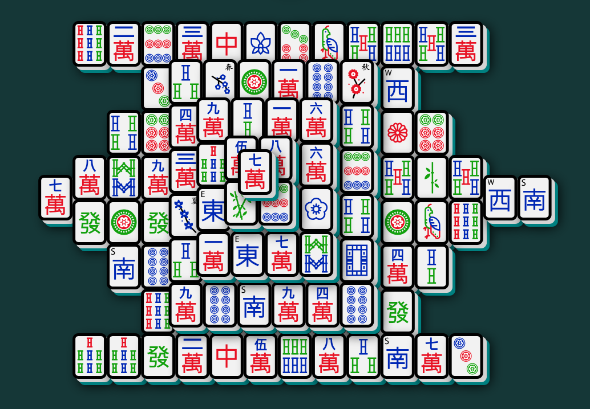
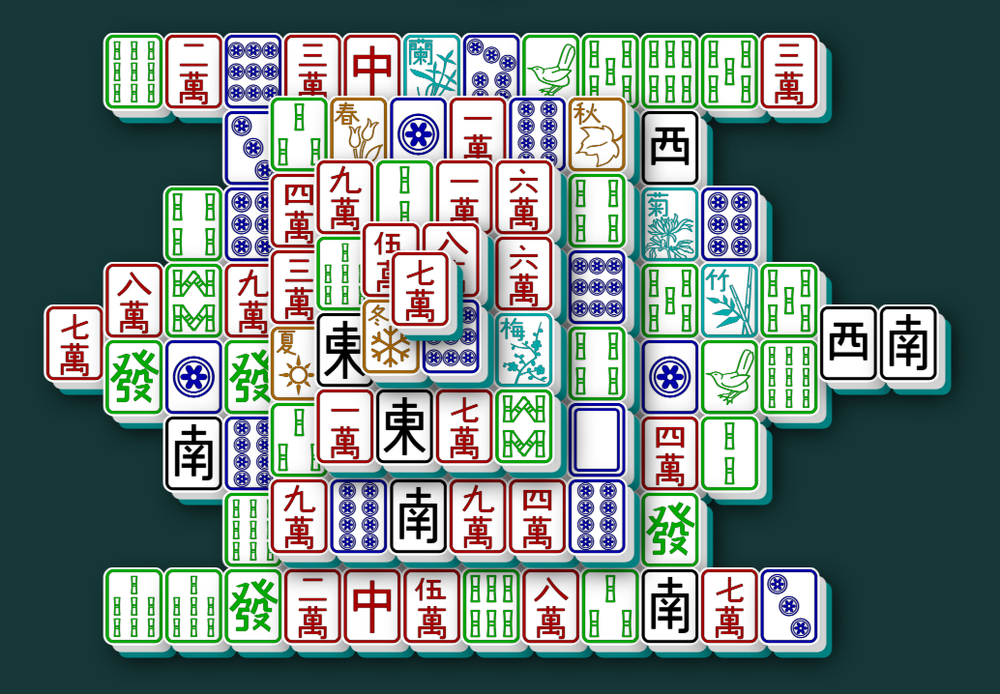

# 🀄 Unicode Mahjong Tile Solitaire 🀄

**[Unicode Mahjong Tile Solitaire](https://teaplz.github.io/UMTSolitaire)** 
is a simple web adaptation of the [Mahjong solitaire](https://en.wikipedia.org/wiki/Mahjong_solitaire) puzzle game that does not use any custom images or fonts for displaying tiles, instead utilizing the [Mahjong Tiles Unicode block](https://en.wikipedia.org/wiki/Mahjong_Tiles_(Unicode_block)) with system fonts, either adjusted with CSS to better resemble tiles or using non-standard emoji variants (namely Microsoft's Segoe UI Emoji).

This is a simple implementation of the original puzzle game in two flavors ([Traditional](https://en.wikipedia.org/wiki/Mahjong_solitaire) and [Two-Corner](https://en.wikipedia.org/wiki/Shisen-Sho)) and utilizes mouse or touch controls in desktop or mobile devices. Features include:

* Helpful buttons to either revert back to a previous board state (Undo, resembling arrows) or show valid matches (Hint, resembling an eye). 
* Choose from some pre-made tile arrangements for a quick play, or create your own tile arrangements with the built-in Layout Editor and share it with friends! 
* Change the table color to the one that best fits your mood. Tile back colors are currently not changeable.

Keyboard support, as well as other forms of accessibility support, are currently unimplemented.

### Traditional

Given a multi-layered stack of tiles, match exposed pairs of tiles of the same to remove them. Tiles are only considered exposed if they can be moved along one of their shorter sides (left or right) without disturbing any other tile (including those above them).

### Two-Corner

Similar to Traditional, but tiles are no longer stacked on top of each-other and all tiles are now considered exposed, but can only be matched as a pair if they follow the rule of "nikakudori" (or "two-angle take"):

- When matching pairs, a path of 1-3 orthogonal line segments must be imagined between them so that no line touches any other tile. This, by definition, forms less than three right angles, or up to two "corners".

## Technical Information

This project was developed with [React](https://reactjs.org/), uses the [Vite](https://vitejs.dev/) toolchain, and is hosted on [GitHub Pages](https://pages.github.com/). Some technical features of the game include:

* From-scratch algorithms for generating the game board and detecting valid matches. Includes both a purely random shuffle and a unique shuffle that always generate winnable boards. Supports seeding for replayable games and multiple tile distribution options.

* In-game puzzle layout editor for creating and sharing custom puzzles.

* Reponsive game board that adjusts automatically to window size, orientation, and pointer style. Supports both emoji and text glyph fonts.

* Use of React's virtual DOM for game and board state.

* Limited [PWA](https://en.wikipedia.org/wiki/Progressive_web_application) support.

The game will not display correctly in earlier browsers and may not display correctly with certain fonts.

---

     
    A game board rendered using non-standard emojis, via the font Segoe UI Emoji on Windows 10.

     
    The same board rendered using the same font, but as Unicode glyphs.

---

The source code is licensed under the [MIT license](LICENSE).